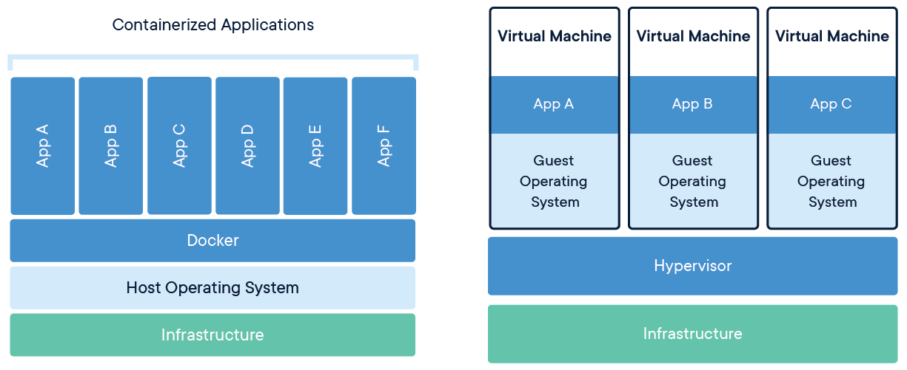
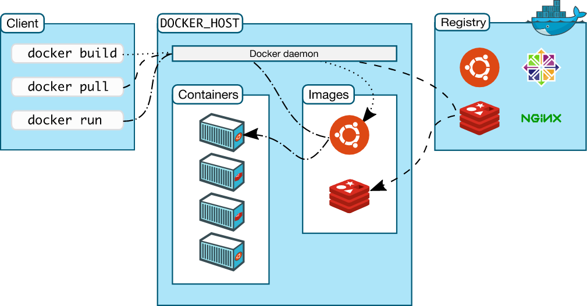

# Docker Guide - README


##  What are Containers?
Containers are lightweight, portable environments that package applications with their dependencies, ensuring consistency across different computing environments.

##  Containers vs Virtual Machines




| Feature            | Containers | Virtual Machines |
|--------------------|-----------|-----------------|
| Isolation         | Process-Level | Full OS-Level |
| Startup Speed    | Fast (Seconds) | Slow (Minutes) |
| Size             | MBs | GBs |
| Performance      | Near Native | Overhead Due to Hypervisor |
| Portability      | High | Medium |

##  What is Docker?
Docker is an opensource containerization tool used to package applications along with its libraries and dependencies into small standalone and isolated units known as containers.

##  Installing Docker
### **Linux (Fedora example)**
```bash
sudo dnf install docker
sudo systemctl start docker
```
### **Windows & Mac** 
- Download from [Docker Official Site](https://www.docker.com/)
- Follow the installation steps.

##  Docker Architecture

 
- **Docker Client:** Sends commands to the Docker daemon.
- **Docker Daemon:** Runs on the host machine and manages containers.
- **Docker Images:** Blueprints for containers.
- **Docker Registry:** Stores and distributes images (Docker Hub).
- **Containers:** Running instances of Docker images.

## Enable Normal User to Use Docker
```bash
sudo usermod -aG docker username
```
##  Docker Container Lifecycles

- 1. Created
    • The container has been created, but it hasn’t started yet.
    • State: CREATED
    • Example: A container is created using docker create, but it hasn't been run yet.
- 2. Running
    • The container is currently running.
    • State: RUNNING
    • Example: After running a container using docker run, it enters this state and begins executing its commands.
- 3. Paused
    • The container is temporarily paused, meaning all its processes are stopped, but the container is still running.
    • State: PAUSED
    • Example: A container can be paused using docker pause <container_name_or_id> and later resumed with docker unpause.
- 4. Stopped
    • The container is stopped and no longer running.
    • State: STOPPED
    • Example: A container can be stopped using docker stop <container_name_or_id>. It is no longer executing any processes, but its data still exists.
- 5. Exited
    • The container has stopped running, either because the main process in the container completed or was manually stopped.
    • State: EXITED
    • Example: A container that runs a short-lived process and finishes execution will exit. You can check this state using docker ps -a.
- 6. Dead
    • This state is rare. A container is in this state when it encounters an internal error or when it becomes unresponsive.
    • State: DEAD
    • Example: A container in a "dead" state requires manual intervention for cleanup.

## Docker Registry
A Docker Registry is a storage and distribution system for Docker images. It holds images and allows users to upload (push) or download (pull) images. A registry can be private or public and is used to store and manage images for deployment in containers.
    • A registry can be hosted on your own infrastructure or a cloud provider.
    • Docker Hub is the default public registry for Docker images.
    • Docker images are stored as repositories in the registry.
    - **Public vs. Private:** Registries can be public, meaning anyone can access and pull images, or private, which requires authentication. Private registries are crucial for organizations to securely store their proprietary or sensitive application images without exposing them to the public.

## Docker Hub
Docker Hub is the default public Docker registry provided by Docker Inc. It is a cloud-based repository where you can store and share Docker images. It is the largest collection of Docker images in the world and is widely used by developers to find and use pre-built images.
    • Docker Hub is free for public repositories (private repositories require a paid account).
    • It contains images for popular software, frameworks, and tools that can be pulled and used easily.
    • You can create your own Docker Hub account to manage personal repositories.
    • On Docker Hub, images are organized into repositories. Each repository can contain multiple versions of an image, identified by tags (e.g., my-image:latest, my-image:1.0). This system allows for version control and easy retrieval of specific image versions.

## Docker Daemon vs Docker Engine
Docker Engine is the full client-server platform that includes the Docker Daemon, CLI, and API to manage container lifecycle and operations. Docker Daemon is the background service within Docker Engine that executes commands, manages containers, and handles image and network operations.
## Docker Daemon
The background service that runs on your system. It manages images, containers, volumes, networks. Listens to Docker API requests.
## Docker Engine
The complete Docker platform including the Daemon, CLI, REST API, container runtime (containerd), and build tools.

##  Essential Docker Commands
```bash
docker version         # Check Docker version
docker ps             # List running containers
  - docker ps -a      # List all containers
  - docker ps -q      # List container id only of the running containers   
docker images         # List downloaded images in your local machine
docker rmi            # To remove an image
docker run            # Run a container
docker stop <ID>      # Stop a container
docker rm <ID>        # Remove a container
docker rm -rf <ID>    # To stop and remove a container forcefully
```

##  What is a Dockerfile?
A Dockerfile is a textfile containing the instructions to build a docker image.

## What is Docker Image?
A docker image is a read-only template which consist of application along with its libraries and dependencies used to create containers.

##  Writing a Dockerfile
### **Basic Dockerfile Structure:**

### **1. FROM**
The FROM instruction in a Dockerfile specifies the base image for your new image. It's the very first instruction in almost every Dockerfile and sets the foundation upon which your image is built.
You can think of it as starting with a pre-built operating system or a minimal environment. For example, FROM ubuntu:22.04 starts your image with a copy of the Ubuntu 22.04 operating system, while FROM python:3.9-slim starts with an image that already has Python 3.9 installed.

### **2. WORKDIR**
The WORKDIR instruction in a Dockerfile sets the working directory for any subsequent RUN, CMD, ENTRYPOINT, COPY, and ADD instructions.
Think of WORKDIR as the cd (change directory) command in a terminal. When you set WORKDIR /app, all commands that follow it will execute from the /app directory inside the container's file system. This is a best practice for organizing your application files.

### **3. COPY**

- Copies files and directories from the host machine to the container.

- Used for transferring static files like application code.

### **4. ADD**

- Similar to COPY but also allows adding files from remote URLs.

- Can automatically extract .tar.gz archives.

### **5. LABEL**

- The LABEL instruction in a Dockerfile adds metadata to an image. This metadata is stored as key-value pairs and is non-executable, meaning it doesn't affect the image's runtime behavior.
- To check the labels of an image, execute the command `docker inspect <image-id>`

### **6. ENV**
- The ENV instruction in a Dockerfile sets environment variables within the image. These variables are essentially key-value pairs that can be accessed by the software running inside the container.
- Think of ENV as a way to set configuration variables that your application can use at runtime. This is a powerful feature for several reasons:

   **Configuration:** Instead of hardcoding values like database connection strings or API keys, you can define them as environment variables. This makes the image reusable in different environments (e.g., development, staging, production) without needing to rebuild it.

   **Non-sensitive Data:** While you shouldn't use ENV for secrets like passwords (use Docker secrets or other vault solutions for that), it's perfect for non-sensitive configuration, such as a port number, a default file path, or a feature flag.

EXAMPLE
```
# Setting a single environment variable
ENV GREETING="Hello, World!"

# Setting multiple environment variables on a single line
ENV APP_PORT=8000 DB_HOST="database"
```

### **7. RUN**

- Executes commands during the image build process.

- Commonly used for installing dependencies and setting up configurations.
  
### **8. CMD**

- Defines the default command that runs when the container starts.

- Can be overridden at runtime.

### **9. ENTRYPOINT**

- Similar to CMD, but ensures that the specified command always runs.

- Commonly used for defining fixed executable commands.

### **10. EXPOSE**

- Declares the ports on which the container will listen.

- Does not actually publish the port, it is just a documentation step.

### **11. USER**

- Specifies the user under which the container should run.

- Helps improve security by avoiding running as root.

### **12. VOLUME**

- Creates a mount point for data persistence.

- Ensures that certain directories are not deleted when the container stops.

### **HEALTHCHECK**
- The HEALTHCHECK instruction in a Dockerfile tells Docker how to test if a running container is still working correctly.

Syntax
The HEALTHCHECK instruction has three main parts:
```
HEALTHCHECK [OPTIONS] CMD command
```
**[OPTIONS]:** These control the behavior of the health check.

**--interval=DURATION:** How often to run the check (default: 30s).

**--timeout=DURATION:** How long to wait for a command to return (default: 30s).

**--start-period=DURATION:** How long to wait before starting the health checks. This is useful for applications that need time to initialize (default: 0s).

**--retries=N:** How many consecutive failures are needed to consider the container unhealthy (default: 3).

**CMD:** The command to execute.

### **ARG**
- The ARG instruction in a Dockerfile defines a build-time variable. It allows you to pass a variable from the command line to your Dockerfile when you build the image.
- ARG variables are only available during the image build process. They are not available in the final image after the build is complete. This is the key difference between ARG and ENV. ARG is for temporary values * needed for the build (e.g., a version number to download a package), whereas ENV is for permanent environment variables that the running container will need.
- You can define an ARG with or without a default value. If no default value is provided, you must pass the value at build time using the `--build-arg` flag.
* Example
Let's say you want to build an image for a specific version of your application. Instead of changing the Dockerfile every time, you can use ARG:
```
# Define a build-time argument for the app version
ARG APP_VERSION=1.0.0

# Download the specified version of the application from a URL
RUN wget https://example.com/myapp-v${APP_VERSION}.tar.gz
```
To build this image, you would use the following command:
```
docker build -t my-app:1.0.0 --build-arg APP_VERSION=1.0.0 .
```

### **ONBUILD**

- Specifies a trigger that runs when the image is used as a base image in another Dockerfile.

- Useful for creating parent images with predefined build steps.


## Dockerfile Example
```dockerfile
# Base Image
FROM python:3.9-slim

# Metadata
LABEL maintainer="Bhuvan <bhuvan@example.com>"

# Environment Variables
ENV APP_HOME=/usr/src/app
WORKDIR $APP_HOME

# Copying Files
COPY . .

# Installing Dependencies
RUN pip install -r requirements.txt

# Exposing Port
EXPOSE 5000

# Healthcheck
HEALTHCHECK --interval=30s --timeout=5s --retries=3 CMD curl -f http://localhost:5000 || exit 1

# Default Command
CMD ["python3", "app.py"]

```


##  Other Docker Tools
- `docker inspect <container>` - Detailed info about a container.
- `docker logs <container>` - View logs.
- `docker exec -it <container> bash` - Access a running container.

## Docker Networking
## Docker networking allows containers to communicate:
- With each other
- With the host machine
- With the outside world (like the internet)
      
## Why Do Containers Need Networks?
Containers are isolated — they need a network to:
- Talk to databases or services
- Serve websites or APIs to users
- Download updates or dependencies from the internet

## Docker Network Types

1. Bridge (default)
    - Default network for standalone containers.
    - Containers can communicate using container names (DNS resolution).
    -  Has outbound internet access (via NAT).
2. Host
    -  Container shares the host’s network stack.
    -  No isolation — useful for performance but less secure.
    -  No port mapping needed (uses host ports directly).
3. None
    -  Container is completely isolated from all networks.
    -  No external or inter-container communication.
4. Overlay
    - Used for multi-host container communication (requires Swarm).
    - Enables distributed networks across Docker nodes.
5. Macvlan
    - Assigns a MAC address to each container.
    -  Containers appear as physical devices on the network.
    -  Useful for direct network access like DHCP.
The Bridge network is the default network driver used when you don't specify a network while starting a container. It’s designed for containers running on the same Docker host to communicate with each other.

## Reserved IPs in Bridge Network

* In a bridge network cidr 172.17.0.0/16, the following are reserved:

- 172.17.0.0	 - Network address (reserved)
- 172.17.0.1	 - Gateway (used by bridge interface on host)
- 172.17.0.2 onwards	Assigned to containers
- 172.17.255.255	 - Broadcast address (reserved)


#Docker Networking Commands
List all Docker networks
```bash
docker network ls
```
To inspect a specific network
```bash
docker network inspect <network-name>
```
Create a user-defined bridge network
```bash
docker network create my-bridge
(by default docker creates a bridge network if --driver is not mentioned)
```
Run a container with a specific network
```bash
docker run -dit --name container1 --network my-bridge ubuntu
```
Connect an existing container to a network
```bash
docker network connect my-bridge container2
```
Disconnect a container from a network
```bash
docker network disconnect my-bridge container2
```
Remove a user-defined network
```bash
docker network rm my-bridge
```

## Docker multi-container connection hands-on Project

**https://github.com/bhuvan-raj/Docker-word-counter-app.git**

## Why do we need Docker storage
Containers are ephermeral in nature, which means it can go down at any time. So inorder to store data we uses docker storages
mainly there are two  types of storage:
## Bind-mounts
- Bind mounts link a specific folder on your host machine (e.g., /home/user/code) to a folder in your container.You control the exact path on the host.
- Mainly bind-mounts are used in Development stages for Live sync between host files and container.


How to create Bind-mounts
```
docker run -v /home/bubu/app:/app nginx
```
This binds /home/bubu/app from your host to /app in the container.

using --mount
```
docker run --mount type=bind,source=/host/path,target=/container/path nginx
```


## Docker Volume

- Docker volumes are a way to store data outside of containers so that the data doesn't get deleted when the container is removed. They allow containers to save important information like databases or files that need to persist, and multiple containers can share the same volume to access the same data. Docker volume is entirely managed by  Docker itself.
- Stored in Docker's directory on the host (/var/lib/docker/volumes/ on Linux)
- Can be named or anonymous

Create and use a named volume
```bash
docker run -v my-data-volume:/app/data nginx
```
using --mount (more explicit)
```
docker run --mount source=my-data-volume,target=/app/data nginx
```
Creating an anonymous volume
```
docker run -v /app/data nginx
```

## Docker -v vs --mount
- -v (--volume) is the older, simpler syntax that combines all options into one string with colon separators
- --mount is more verbose but clearer and less error-prone, especially for complex configurations, while -v is shorter and faster to type for simple use cases. Both do the same thing, but --mount provides better error messages and is recommended for new users.

##  Docker volume commands

Create a volume
```
docker volume create my-volume
```
List all volumes
```
docker volume ls
```
 Inspect a volume
 ```
docker volume inspect my-volume
```
 Remove a volume
 ```
docker volume rm my-volume
```
 Remove all unused volumes
 ```
docker volume prune
```

You need Docker storage because **data inside a container is ephemeral**, meaning it's deleted forever when the container is removed. Docker storage mechanisms allow you to save—or **persist**—important data outside the container's lifecycle.

This is crucial for any stateful application, such as a database that needs to retain its records, a web server that stores user uploads, or an application that generates logs you need to analyze later. Without a storage solution, you would lose all that essential information the moment the container stops.

-----

### \#\# ⚡ `tmpfs` Mounts

A `tmpfs` mount is a temporary storage option that is **not persistent**. It stores data directly in the host machine's RAM.

**Key features:**

  * **Extremely Fast:** Since it operates in memory, it's ideal for temporary files you need to access quickly.
  * **Non-persistent:** The data is completely wiped out when the container stops.
  * **Secure:** Useful for storing sensitive information like tokens or keys during a container's runtime without ever writing them to disk.

#### \#\#\# Using a `tmpfs` mount

You use the `--tmpfs` flag to create this type of mount. You cannot share `tmpfs` mounts between containers.

```bash
# This creates a temporary filesystem at /app/temp inside the container
docker run -d --name my-app --tmpfs /app/temp nginx
```

-----

### \#\# 🛠️ Docker Volume Commands

Here are the essential commands for managing your Docker volumes directly.

| Command | Description |
| :--- | :--- |
| `docker volume create my-volume` | Creates a new volume named `my-volume`. |
| `docker volume ls` | Lists all existing volumes on your system. |
| `docker volume inspect my-volume` | Shows detailed information about a specific volume. |
| `docker volume rm my-volume` | Deletes a specific volume. Fails if the volume is in use. |
| `docker volume prune` | **Deletes all unused volumes** not associated with any container. |

##  What is Docker Compose?
Docker Compose is a tool for defining and managing multi-container Docker applications using a simple YAML configuration file (docker-compose.yml). 
It allows users to start, stop, and manage multiple interconnected containers with a single command.

##  Docker Compose Format
```yaml
version: "<version>"  # Defines the Docker Compose version (e.g., "3.8")

services:
  <service_name>:      # Define a service (container)
    image: <image_name>  # Use an existing Docker image
    build: <context>     # Build from a Dockerfile (optional)
    container_name: <name>  # Custom container name
    ports:
      - "<host_port>:<container_port>"  # Map host to container ports
    environment:
      - <KEY>=<VALUE>  # Define environment variables
    volumes:
      - <host_path>:<container_path>  # Mount volumes for data persistence
    networks:
      - <network_name>  # Connect to a network
    depends_on:
      - <another_service>  # Define service dependencies
    restart: <policy>  # Restart policy (always, unless-stopped, on-failure)
    command: <cmd>  # Override the default command
    healthcheck:     # Define a health check
      test: ["CMD", "<command>"]
      interval: <time>
      timeout: <time>
      retries: <count>

volumes:
  <volume_name>:  # Define persistent volumes

networks:
  <network_name>:  # Define custom networks
    driver: <network_driver>  # Network driver (e.g., bridge, overlay)
```
## Docker Compose Hands-on Project

**https://github.com/bhuvan-raj/Docker-Compose-WordCounter.git**


## Conclusion
This README provides a structured guide to Docker, from basics to hands-on projects. Explore further with **Docker Networking, Volumes, and Kubernetes!**

